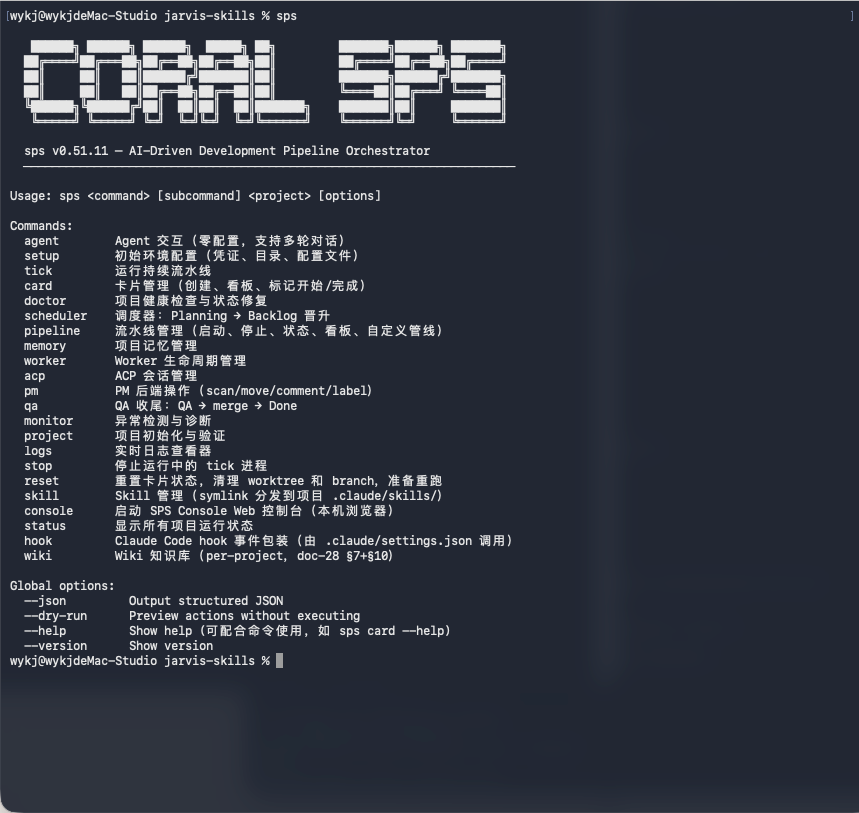
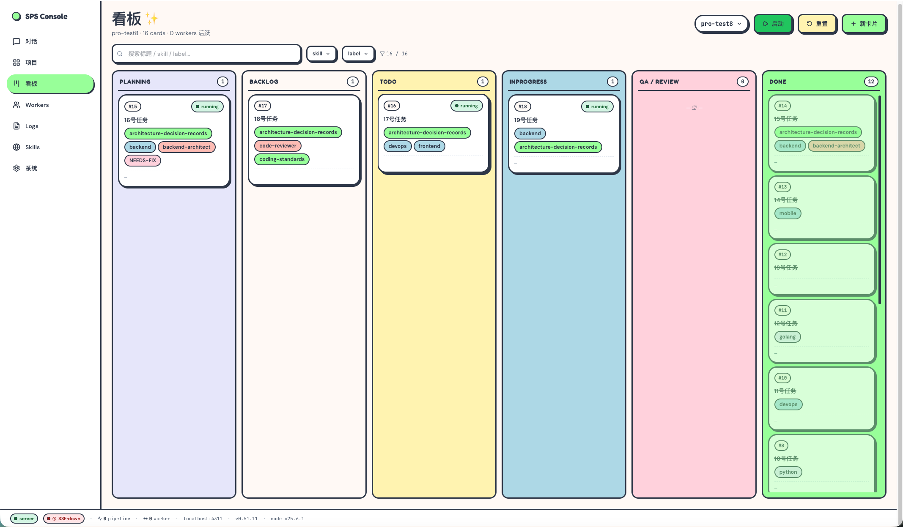
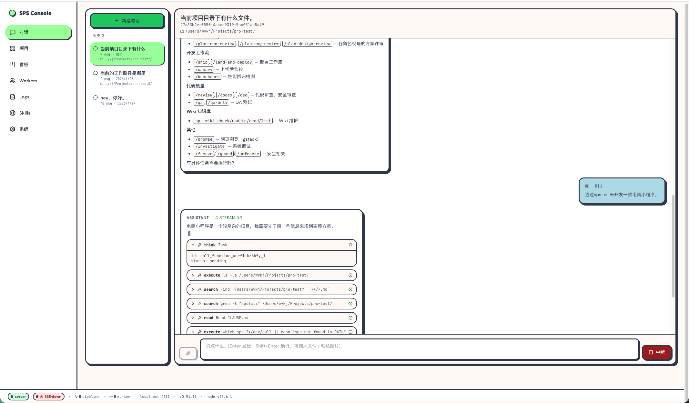
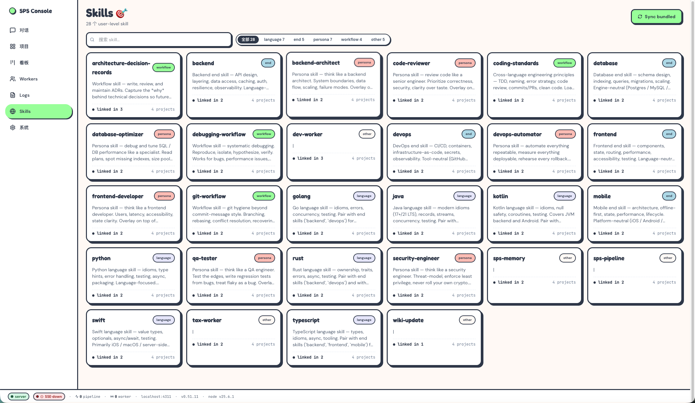
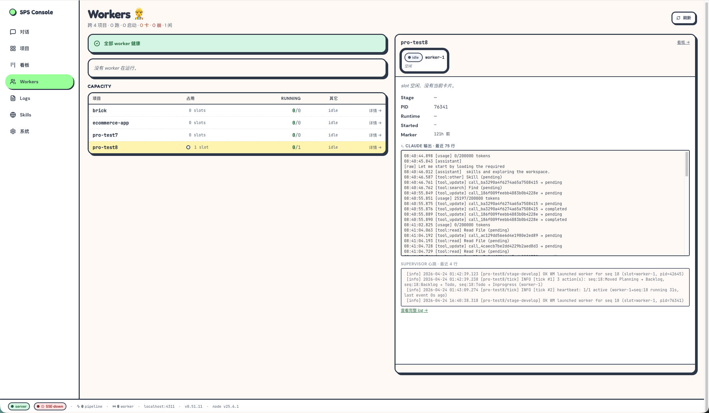
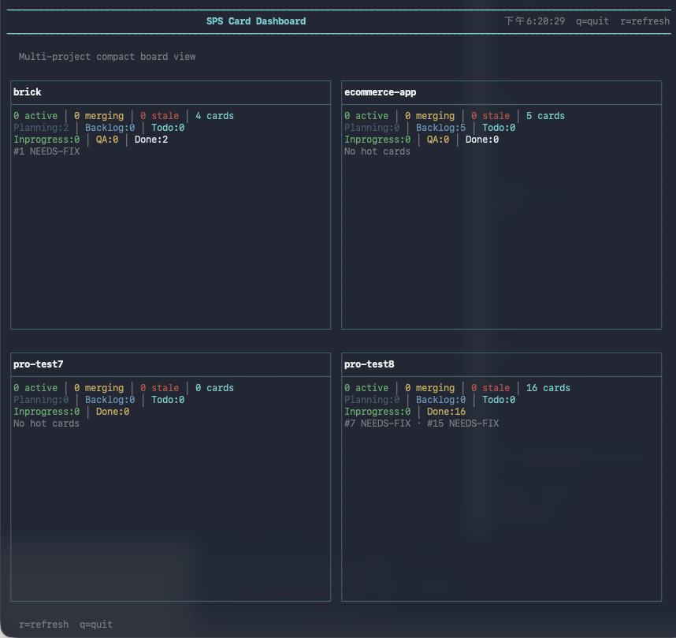

# SPS CLI

[](https://www.npmjs.com/package/@coralai/sps-cli) [](./LICENSE)

> 中文文档：[README-CN.md](./README-CN.md)

## 1. Introduction

SPS (Smart Pipeline System) is an open-source **AI-agent harness** that turns a single-line task into reviewed, committed, deployable output. It drives an underlying agent through a card-based pipeline — plan, execute, review, ship — with a per-project knowledge base auto-injected into every prompt.

### 24/7 unattended software development

Drop tasks into the backlog and the harness runs them around the clock — planning, coding, testing, committing, opening MRs, escalating only when truly blocked. While you sleep, the pipeline ticks; your morning standup reads the merged commits. SPS exists so a single human can run a development team's worth of work without sitting in front of a chat window.

### Beyond software — extensible to any domain via skills

The pipeline, skills, and knowledge layer are intentionally generic. Any process that can be expressed as "task in → reviewed output out" can be wired up by swapping the skill bundle:

- **Accounting** — invoice intake → categorization → ledger reconciliation → period close
- **Self-media** — topic research → drafting → review → publishing
- **AI video generation** — script → storyboard → render → cut → review
- **Writing** — research → outline → draft → revise → publish
- **Any other workflow** — define stages in YAML, write skills in markdown; the harness runs them

One CLI, one console, one filesystem-driven workflow. No vendor lock-in.



## 2. Core Concepts

### Harness
A long-running shell around the AI agent: daemon, supervisor, transport, profile management, file-system task lifecycle. The agent focuses on writing code; the harness owns the infrastructure.

### Pipeline
Each task is a **card** that flows through stages: `Backlog → Planning → Todo → Inprogress → QA → Done`. Every stage has its own prompt, allowed tools, exit gates — all configurable in YAML.

### Skills
Stages dispatch atomic **skills** to drive each task — `sps-pipeline`, `wiki-update`, `git-commit`, persona skills, and 24 dev skills bundled. Skills compose without ballooning the system prompt; the harness loads only what the current stage needs.

### Memory
A 3-layer markdown-on-disk persistence for **non-obvious, reusable facts** that should survive across sessions. Lives entirely under `~/.coral/memory/`; auto-injected into every pipeline worker prompt by `StageEngine`.

| Layer | Path | Scope |
|---|---|---|
| **User** | `~/.coral/memory/user/` | Cross-project preferences (style, language, workflow habits) |
| **Agent** | `~/.coral/memory/agents/<id>/` | Per-agent observations (communication patterns specific to one agent ↔ user pair) |
| **Project** | `~/.coral/memory/projects/<name>/` | Per-project conventions, architecture decisions, lessons, references |

Four entry types — `convention` (never decays), `decision` (slow), `lesson` (30-day decay), `reference` (never decays). Each layer keeps a flat directory of `*.md` files plus a `MEMORY.md` index. The agent reads it on demand and writes back when it discovers something worth keeping — a sparse, private drift; complementary to the dense, shared Wiki below.

### Knowledge Base — LLM Wiki

Inspired by Andrej Karpathy's "LLM Wiki": instead of re-reading source code from scratch every session, the agent **distills** project knowledge into a persistent, structured wiki that primes every future prompt.

**The problem**: An AI agent re-discovering your codebase on every task burns tokens, misses non-obvious decisions, and walks into the same gotcha twice. Most of the knowledge in a codebase is implicit — in commit context, in design tradeoffs, in incident postmortems that never made it back into the source.

**The wiki**: Workers continuously distill code, design docs, and completed cards into atomic, cross-linked pages:

| Page type | What it captures |
|---|---|
| `modules/` | What each component does and how it's used |
| `concepts/` | Recurring patterns and architectural primitives |
| `decisions/` | Why a specific choice was made (with version anchor) |
| `lessons/` | Non-obvious gotchas surfaced from incidents |
| `sources/` | Distilled summaries of external materials added to `.raw/` (PDFs, articles, transcripts) |

**Self-maintaining**: After each card, the worker auto-writes back any new lessons or module changes — no manual curation. SOP lives in `skills/wiki-update/` and follows a 4-question filter (module changed? decision made? lesson learned? new pattern?). Four NOs = no write.

**Self-retrieving**: Every card prompt receives 5-layer auto-injection (~2K tokens) so the worker starts informed:

- **L1** `hot.md` — recent context (~500 tokens)
- **L2** `index.md` excerpt — top-30 page TL;DRs (~500 tokens)
- **L3** pinned pages — explicitly referenced in card frontmatter
- **L4** skill-tag matches — pages tagged with the card's active skills
- **L5** BM25F keyword fallback — top-3 by title/desc

**Compounds over time**: Each completed card adds to the corpus. The longer a project runs, the better workers understand it without reading raw source. Old workers' lessons prime new workers — the wiki *is* the project's institutional memory.

**Obsidian-compatible**: Stored at `<repo>/wiki/` with `[[wikilink]]` syntax and flat YAML frontmatter. Open the directory as an Obsidian vault for graph view, backlinks, and full-text search out of the box.

### Agent Mode
SPS is **agent-agnostic**. Any coding agent that can read a skill and shell out — Claude Code, Codex, OpenClaw, your own — can drive SPS through the bundled `sps-pipeline` skill. The harness adapts to the agent, not the other way around. Wiring up a new agent means dropping a skill file; no SPS code change required. See [§6](#6-supported-agents) for the integration matrix.

## 3. Console

Launch the local web UI:

```bash
sps console                      # opens http://127.0.0.1:4311
sps console --port 5000          # custom port
sps console --no-open            # don't auto-open the browser
sps console --kill               # stop a running console
```

Single command, no extra services — kanban, chat, skills, workers, logs, projects all in one place.

**Kanban — card-driven workflow at a glance**



**Chat — multi-turn agent conversations with tool-call streaming**



**Skills — bundled & per-project skill management**



**Workers — capacity, runtime, stage-by-stage logs**



## 4. Install

```bash
# Install
npm install -g @coralai/sps-cli
sps setup                       # one-time interactive wizard

# Update
npm update -g @coralai/sps-cli
sps skill sync --force          # pull updated skill SOPs after upgrade
```

### Build from source

```bash
git clone https://github.com/edwardZhang/sps-cli.git
cd sps-cli
npm install
npm run build                   # tsc + console assets
npm link                        # symlink `sps` to local build
```

### Prerequisites

- **Node.js ≥ 18**
- **A working Claude Code installation locally.** Run `claude --help` first — if that works for you, SPS will work. SPS does not care **how** you authenticate Claude Code:
  - Anthropic API key (`ANTHROPIC_API_KEY`)
  - Claude Pro / Max subscription
  - Third-party API gateway / proxy
  - Any other auth method Claude Code supports

  SPS spawns `claude` over the Agent Client Protocol; it inherits whatever credentials you've already configured. No separate SPS-side API key needed.

## 5. Quick Start

### Step 1 — Run the setup wizard (one time)

```bash
sps setup
```

The wizard:
- Creates `~/.coral/{projects,memory,sessions,skills}/` directory tree
- Copies bundled skills into `~/.coral/skills/` and symlinks them into `~/.claude/skills/` so Claude Code picks them up
- Installs `@agentclientprotocol/claude-agent-acp` globally so `claude` can be driven over ACP
- Optionally writes `~/.coral/env` (GitLab token, Matrix notification, etc. — all optional)

Re-runnable safely: `sps setup --force` keeps existing values as defaults. After upgrading sps-cli later, run **`sps skill sync --force`** to pull updated skill SOPs.

### Step 2 — Smoke-test with the agent (no project needed)

```bash
sps agent "Explain this repo"           # one-shot
sps agent --chat                        # multi-turn REPL, persistent session
```

If this works, your Claude Code auth is good and SPS is wired correctly.

### Step 3 — Launch the console

```bash
sps console                             # http://127.0.0.1:4311
```

### Step 4 — Run a pipeline

```bash
sps project init my-app --repo /path/to/repo    # initialize a project
sps card add my-app "Add a login button"        # add a task card
sps tick my-app                                 # advance active cards one stage
```

**TUI dashboard** — compact multi-project view (`sps status`):



## 6. Supported Agents

SPS-CLI is shell-driven, so any coding agent that can read a skill and execute commands can use it as a task harness. We ship `skills/sps-pipeline/` — install it into the agent's skill directory and the agent immediately learns the full SPS command surface (cards, pipeline ticks, wiki, project setup, daemon lifecycle).

| Agent | Wire-up |
|---|---|
| **Claude Code** | ✅ `sps skill sync` symlinks `sps-pipeline` into `~/.claude/skills/`; auto-loaded on description match |
| **Codex** | ✅ Drop `skills/sps-pipeline/SKILL.md` into the Codex skill directory |
| **OpenClaw** | ✅ Same — point its skill loader at `skills/sps-pipeline/` |
| **Harness Agent** | ✅ Same pattern — the skill is agent-agnostic |
| **Any other coding agent** | ✅ If it reads instructions and shells out, it can drive SPS |

The skill is plain markdown — copy it, adapt it, fork it. SPS owns orchestration; the agent owns intent.

## 7. Acknowledgements

SPS stands on the shoulders of:

- **Andrej Karpathy** — ["LLM Wiki"](https://gist.github.com/karpathy) mental model — the foundation for SPS's knowledge layer
- **Anthropic Claude Agent SDK** — ACP transport, sub-agent infrastructure
- **kepano / claude-obsidian** (MIT) — Wiki architecture, manifest, hot cache. Full attribution in [ATTRIBUTION.md](./ATTRIBUTION.md)
- **hono · chokidar · zod · yaml · vitest · biome** — runtime & toolchain

## 8. License

[MIT](./LICENSE)

## 9. Copyright

Copyright (c) 2026 Coral AI
